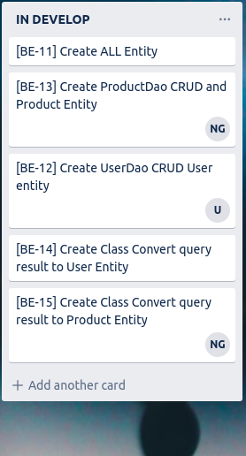
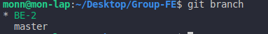
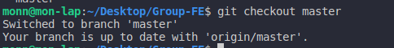

# Git Flow

## Step

### 1 View in trello


### 2 Lựa chọn Task. Mỗi Task sẽ có id riêng [BE-xxx] hoặc [FE-xxx]
- Đứng ở nhanh master( sử dụng lệnh để  kiểm tra vị trí)
```
git branch
```

Ví dụ: Đang đứng ở nhánh BE-2



- Khi ở nhanh khác thì checkout về master ( sử dụng lệnh)

```
git checkout branch_name
```

Ví dụ: checkout về master



- Khi checkout sang master thì pull về để lấy source code mới nhất

```
git pull
```

- Sau khi pull source code mới nhất từ git về  hãy checkout -b để tạo nhánh mới và code dựa vào id của Task. sau khi checkout xong kiểm tra lại băng git status

Ví dụ: làm task [BE-1] abc
```
git checkout -b be-1
```

- Coding Khi rồi push lên nhánh thông qua 3 câu lệnh

```
1. git add *
2. git commit -m "[BE-1] Công việc làm"
3. git push origin branch_name
```

- Lên github tạo pull request Hãy lưu ý message